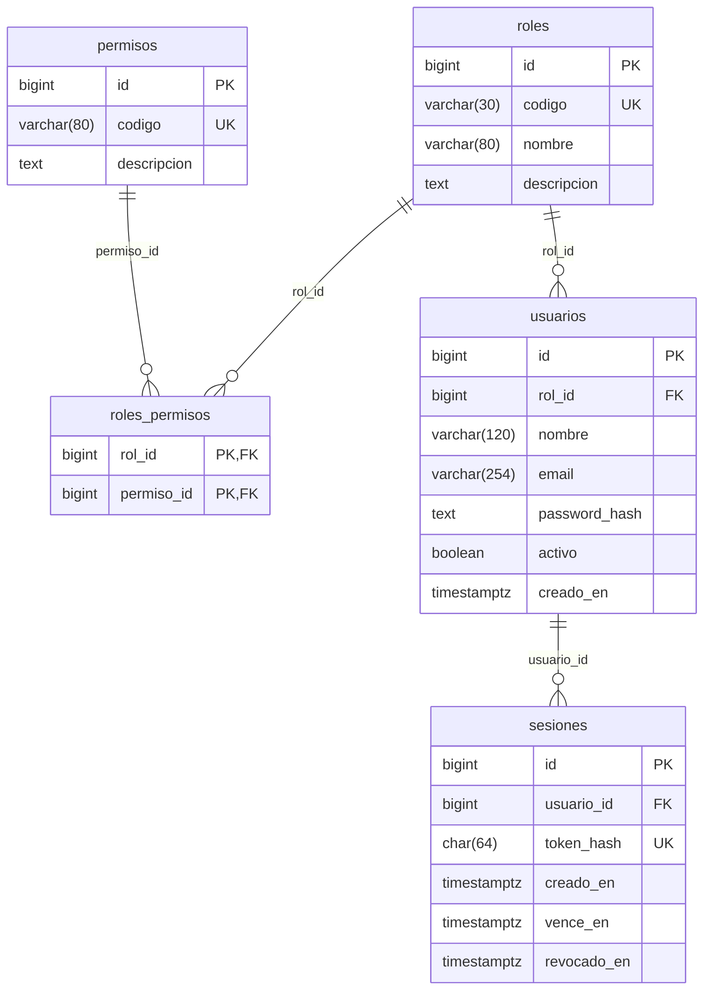
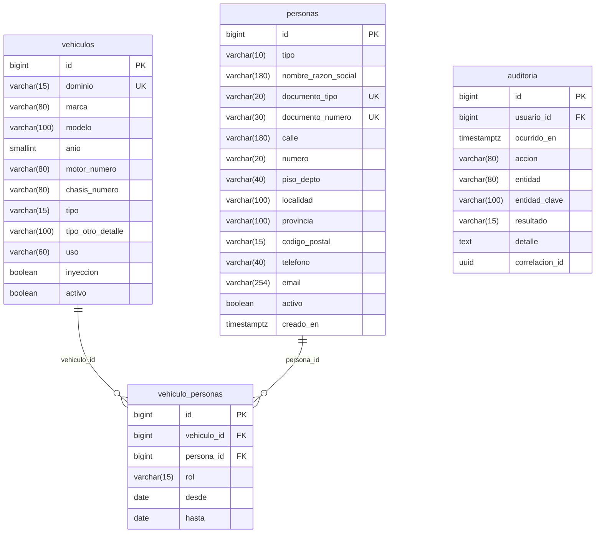
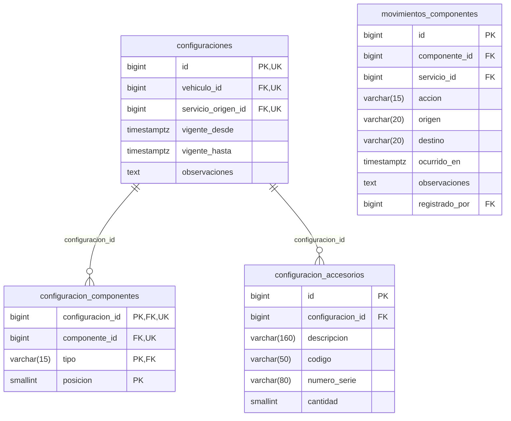
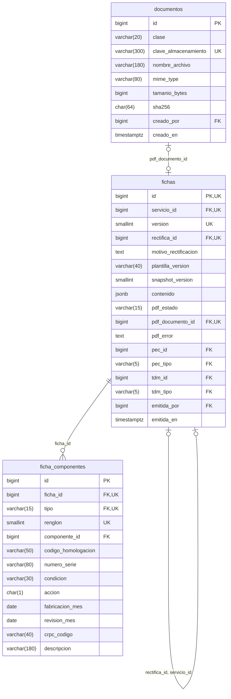
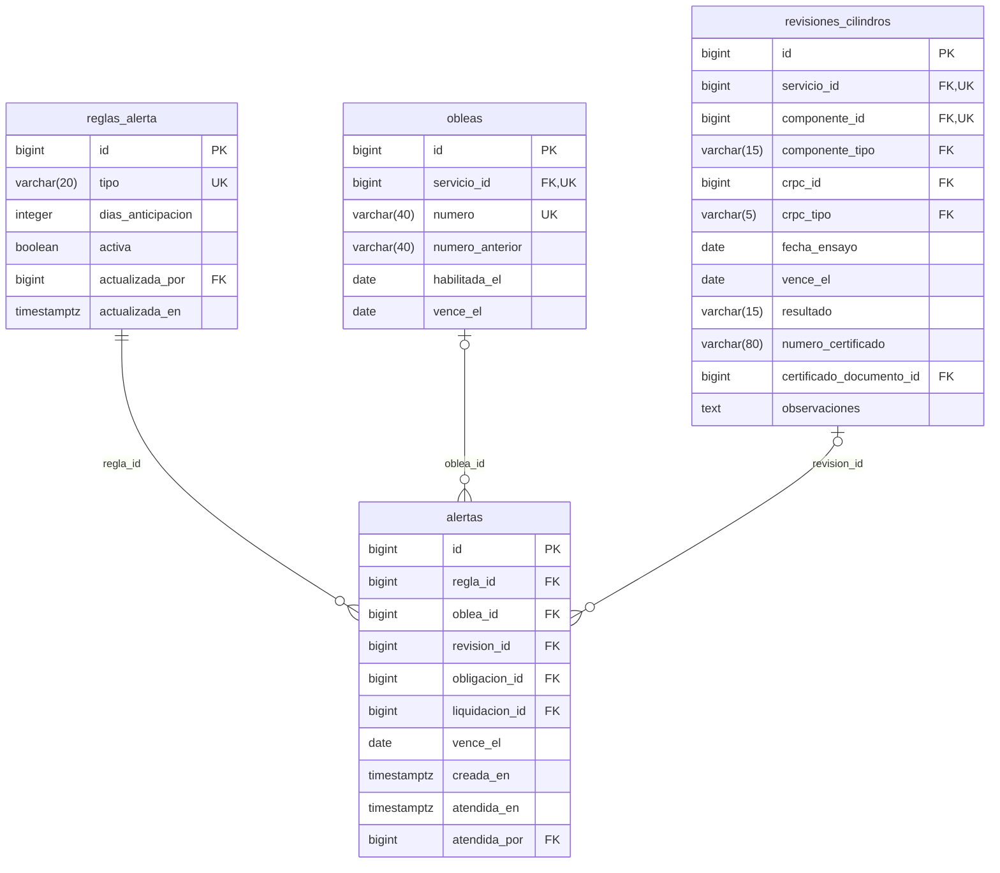

# Diagrama entidad–relación físico — CILGAS

Diseño propuesto · 27/09/2026 · 42 tablas. Cada tabla aparece una vez con **todos sus campos**, tipos y marcas PK/FK/UQ. Las vistas tienen como máximo cinco entidades para poder leerlas; las referencias que cruzan una vista se detallan junto al gráfico. El DDL y [diccionario](DICCIONARIO_DATOS.md) especifican nulabilidad, valores, CHECK e índices; `decimal` significa `numeric` y `string` sólo se usa cuando lo exige Mermaid (se conserva longitud en el diccionario).

Las líneas muestran asociaciones materializadas por FK dentro de una vista. Una FK permite como máximo un padre por registro; `||` exige padre y `|o` lo permite opcional. Los hijos se representan como 0..1 cuando la FK es única y 0..N en los demás casos. `UK` en una columna significa que participa de una restricción de unicidad, que puede ser compuesta; NO afirma unicidad individual. El diccionario y DDL indican los conjuntos exactos. Los límites de 4 cilindros y reglas entre registros se explican en [MODELO_DATOS](../docs/segunda-entrega/MODELO_DATOS.md).

## Identidad y acceso



## Personas, vehículos y auditoría



Referencias hacia otras vistas:

| Origen | Campos FK | Destino | Campos referenciados |
| --- | --- | --- | --- |
| `auditoria` | `usuario_id` | `usuarios` | `id` |

## Actores y componentes

```mermaid
erDiagram
    direction TB
    actores_regulatorios {
        bigint id PK, UK
        varchar(5) tipo UK
        varchar(40) codigo UK
        varchar(180) nombre
        varchar(20) cuit
        varchar(220) domicilio
        varchar(100) localidad
        varchar(40) telefono
        varchar(140) responsable_tecnico
        varchar(40) matricula_responsable
        boolean activo
    }
    proveedores {
        bigint id PK
        varchar(180) nombre_razon_social
        varchar(20) cuit UK
        varchar(40) telefono
        varchar(254) email
        text observaciones
        boolean activo
    }
    modelos_componentes {
        bigint id PK, UK
        varchar(15) tipo UK
        varchar(50) codigo_homologacion UK
        varchar(100) marca
        varchar(100) modelo
        decimal(7,2) capacidad_litros
        boolean activo
    }
    componentes {
        bigint id PK, UK
        bigint modelo_id FK, UK
        varchar(15) tipo FK, UK
        varchar(80) numero_serie UK
        date fabricacion_mes
        date fecha_baja
        text observaciones
    }
    modelos_componentes ||--o{ componentes : "modelo_id, tipo"
```

## Oferta y trabajo concreto

```mermaid
erDiagram
    direction TB
    catalogo_servicios {
        bigint id PK
        varchar(40) codigo UK
        varchar(140) nombre
        text descripcion
        varchar(25) tipo
        decimal(14,2) precio_sugerido
        boolean activo
    }
    catalogo_items {
        bigint id PK
        bigint catalogo_servicio_id FK, UK
        smallint orden UK
        varchar(180) descripcion
        varchar(20) tipo
        decimal(10,2) cantidad
        decimal(14,2) precio_unitario
        bigint proveedor_id FK
        decimal(14,2) costo_unitario
    }
    servicios {
        bigint id PK, UK
        bigint vehiculo_id FK, UK
        bigint catalogo_servicio_id FK
        bigint antecedente_id FK
        bigint configuracion_base_id FK
        varchar(15) estado
        date fecha_servicio
        varchar(180) descripcion
        varchar(25) tipo
        char(1) operacion_ficha
        boolean incluye_ph
        decimal(14,2) importe_total
        text observaciones
        bigint creado_por FK
        timestamptz creado_en
        bigint confirmado_por FK
        timestamptz confirmado_en
        timestamptz cancelado_en
        text motivo_cancelacion
        varchar(100) identificador_sicgnc
        timestamptz registrado_sicgnc_en
    }
    servicio_personas {
        bigint servicio_id PK, FK
        bigint persona_id FK
        varchar(15) rol PK
    }
    catalogo_servicios ||--o{ catalogo_items : "catalogo_servicio_id"
    catalogo_servicios ||--o{ servicios : "catalogo_servicio_id"
    servicios |o--o{ servicios : "antecedente_id"
    servicios ||--o{ servicio_personas : "servicio_id"
```

La relación de renovación admite varios sucesores históricos cancelados (0..N en el ER); el índice parcial `uq_servicio_renovacion_activa` limita a **uno no cancelado** por antecedente. Cada sucesor conserva un único antecedente opcional.

Referencias hacia otras vistas:

| Origen | Campos FK | Destino | Campos referenciados |
| --- | --- | --- | --- |
| `catalogo_items` | `proveedor_id` | `proveedores` | `id` |
| `servicios` | `vehiculo_id` | `vehiculos` | `id` |
| `servicios` | `creado_por` | `usuarios` | `id` |
| `servicios` | `confirmado_por` | `usuarios` | `id` |
| `servicio_personas` | `persona_id` | `personas` | `id` |
| `servicios` | `configuracion_base_id, vehiculo_id` | `configuraciones` | `id, vehiculo_id` |

## Composición y preparación técnica

```mermaid
erDiagram
    direction TB
    servicio_items {
        bigint id PK, UK
        bigint servicio_id FK, UK
        smallint orden UK
        bigint catalogo_item_id FK
        varchar(180) descripcion
        varchar(20) tipo
        bigint componente_id FK
        varchar(15) accion
        decimal(10,2) cantidad
        decimal(14,2) precio_unitario
        decimal(14,2) descuento
        decimal(14,2) importe
    }
    servicio_costos {
        bigint id PK, UK
        bigint servicio_id FK, UK
        bigint servicio_item_id FK
        bigint proveedor_id FK, UK
        varchar(180) concepto
        varchar(15) tratamiento
        decimal(14,2) importe UK
    }
    servicio_preparacion {
        bigint servicio_id PK, FK
        bigint pec_id FK
        varchar(5) pec_tipo FK
        bigint tdm_id FK
        varchar(5) tdm_tipo FK
        varchar(40) oblea_anterior
        varchar(40) oblea_nueva
        date habilitada_el
        date vence_el
        text observaciones_ficha
    }
    servicio_intervenciones {
        bigint id PK
        bigint servicio_id FK, UK
        varchar(15) tipo FK, UK
        smallint renglon UK
        bigint componente_id FK
        varchar(50) codigo_homologacion
        varchar(80) numero_serie
        varchar(30) condicion
        char(1) accion
        smallint posicion_final
        date fabricacion_mes
        date revision_mes
        bigint crpc_id FK
        varchar(5) crpc_tipo FK
        boolean realiza_ph
        date fecha_ensayo
        date vence_revision_el
        varchar(15) resultado_ph
        varchar(80) numero_certificado
        varchar(180) descripcion
    }
    servicio_items |o--o{ servicio_costos : "servicio_item_id, servicio_id"
```

Referencias hacia otras vistas:

| Origen | Campos FK | Destino | Campos referenciados |
| --- | --- | --- | --- |
| `servicio_items` | `servicio_id` | `servicios` | `id` |
| `servicio_items` | `catalogo_item_id` | `catalogo_items` | `id` |
| `servicio_items` | `componente_id` | `componentes` | `id` |
| `servicio_costos` | `servicio_id` | `servicios` | `id` |
| `servicio_costos` | `proveedor_id` | `proveedores` | `id` |
| `servicio_preparacion` | `servicio_id` | `servicios` | `id` |
| `servicio_preparacion` | `pec_id, pec_tipo` | `actores_regulatorios` | `id, tipo` |
| `servicio_preparacion` | `tdm_id, tdm_tipo` | `actores_regulatorios` | `id, tipo` |
| `servicio_intervenciones` | `servicio_id` | `servicios` | `id` |
| `servicio_intervenciones` | `componente_id, tipo` | `componentes` | `id, tipo` |
| `servicio_intervenciones` | `crpc_id, crpc_tipo` | `actores_regulatorios` | `id, tipo` |

## Configuraciones e intervenciones físicas



Referencias hacia otras vistas:

| Origen | Campos FK | Destino | Campos referenciados |
| --- | --- | --- | --- |
| `configuraciones` | `vehiculo_id` | `vehiculos` | `id` |
| `configuraciones` | `servicio_origen_id, vehiculo_id` | `servicios` | `id, vehiculo_id` |
| `configuracion_componentes` | `componente_id, tipo` | `componentes` | `id, tipo` |
| `movimientos_componentes` | `componente_id` | `componentes` | `id` |
| `movimientos_componentes` | `servicio_id` | `servicios` | `id` |
| `movimientos_componentes` | `registrado_por` | `usuarios` | `id` |

## Historia documental



Referencias hacia otras vistas:

| Origen | Campos FK | Destino | Campos referenciados |
| --- | --- | --- | --- |
| `documentos` | `creado_por` | `usuarios` | `id` |
| `fichas` | `servicio_id` | `servicios` | `id` |
| `fichas` | `emitida_por` | `usuarios` | `id` |
| `fichas` | `pec_id, pec_tipo` | `actores_regulatorios` | `id, tipo` |
| `fichas` | `tdm_id, tdm_tipo` | `actores_regulatorios` | `id, tipo` |
| `ficha_componentes` | `componente_id, tipo` | `componentes` | `id, tipo` |

## Resultados y alertas



Referencias hacia otras vistas:

| Origen | Campos FK | Destino | Campos referenciados |
| --- | --- | --- | --- |
| `obleas` | `servicio_id` | `servicios` | `id` |
| `revisiones_cilindros` | `servicio_id` | `servicios` | `id` |
| `revisiones_cilindros` | `certificado_documento_id` | `documentos` | `id` |
| `revisiones_cilindros` | `componente_id, componente_tipo` | `componentes` | `id, tipo` |
| `revisiones_cilindros` | `crpc_id, crpc_tipo` | `actores_regulatorios` | `id, tipo` |
| `reglas_alerta` | `actualizada_por` | `usuarios` | `id` |
| `alertas` | `obligacion_id` | `obligaciones` | `id` |
| `alertas` | `liquidacion_id` | `liquidaciones` | `id` |
| `alertas` | `atendida_por` | `usuarios` | `id` |

## Convenios y medios de pago

```mermaid
erDiagram
    direction TB
    medios_pago {
        bigint id PK
        varchar(25) codigo UK
        varchar(80) nombre
        boolean activo
    }
    convenios {
        bigint id PK
        bigint entidad_persona_id FK
        varchar(120) nombre UK
        text condiciones
        integer plazo_pago_dias
        boolean activo
    }
    liquidaciones {
        bigint id PK, UK
        bigint convenio_id FK, UK
        varchar(60) numero UK
        varchar(15) estado
        date entregada_el
        date vence_el
        decimal(14,2) importe_total
        bigint creada_por FK
        timestamptz creada_en
        text observaciones
    }
    cupones {
        bigint id PK
        bigint convenio_id FK, UK
        bigint servicio_id FK, UK
        varchar(80) numero UK
        decimal(14,2) importe_autorizado
        date autorizado_el
        bigint liquidacion_id FK
        timestamptz anulado_en
        text motivo_anulacion
    }
    convenios ||--o{ liquidaciones : "convenio_id"
    convenios ||--o{ cupones : "convenio_id"
    liquidaciones |o--o{ cupones : "liquidacion_id, convenio_id"
```

Referencias hacia otras vistas:

| Origen | Campos FK | Destino | Campos referenciados |
| --- | --- | --- | --- |
| `convenios` | `entidad_persona_id` | `personas` | `id` |
| `liquidaciones` | `creada_por` | `usuarios` | `id` |
| `cupones` | `servicio_id` | `servicios` | `id` |

## Hechos financieros de ingreso y deuda

```mermaid
erDiagram
    direction TB
    operaciones_cobro {
        bigint id PK
        uuid clave_idempotencia UK
        varchar(15) origen
        bigint liquidacion_id FK
        bigint pagador_id FK
        timestamptz recibido_en
        decimal(14,2) importe_total
        varchar(140) referencia
        bigint creado_por FK
        timestamptz anulado_en
        bigint anulado_por FK
        text motivo_anulacion
    }
    cobros {
        bigint id PK
        bigint operacion_id FK, UK
        bigint servicio_id FK, UK
        bigint medio_pago_id FK, UK
        varchar(15) tipo
        decimal(14,2) importe
        varchar(140) referencia
    }
    obligaciones {
        bigint id PK
        bigint servicio_costo_id FK, UK
        bigint servicio_id FK
        bigint proveedor_id FK
        decimal(14,2) importe FK
        timestamptz nacida_en
        date vence_el
        timestamptz anulada_en
        bigint anulada_por FK
        text motivo_anulacion
    }
    operaciones_cobro ||--o{ cobros : "operacion_id"
```

Referencias hacia otras vistas:

| Origen | Campos FK | Destino | Campos referenciados |
| --- | --- | --- | --- |
| `operaciones_cobro` | `liquidacion_id` | `liquidaciones` | `id` |
| `operaciones_cobro` | `pagador_id` | `personas` | `id` |
| `operaciones_cobro` | `creado_por` | `usuarios` | `id` |
| `operaciones_cobro` | `anulado_por` | `usuarios` | `id` |
| `cobros` | `servicio_id` | `servicios` | `id` |
| `cobros` | `medio_pago_id` | `medios_pago` | `id` |
| `obligaciones` | `anulada_por` | `usuarios` | `id` |
| `obligaciones` | `servicio_costo_id, servicio_id, proveedor_id, importe` | `servicio_costos` | `id, servicio_id, proveedor_id, importe` |

## Hechos financieros de egreso y aplicación

```mermaid
erDiagram
    direction TB
    operaciones_egreso {
        bigint id PK
        uuid clave_idempotencia UK
        varchar(25) tipo
        bigint proveedor_id FK
        bigint cobro_origen_id FK
        timestamptz ocurrido_en
        varchar(180) concepto
        decimal(14,2) importe_total
        varchar(140) referencia
        bigint creado_por FK
        timestamptz anulado_en
        bigint anulado_por FK
        text motivo_anulacion
    }
    egresos {
        bigint id PK
        bigint operacion_id FK, UK
        bigint medio_pago_id FK, UK
        decimal(14,2) importe
        varchar(140) referencia
    }
    pagos_obligaciones {
        bigint egreso_id PK, FK
        bigint obligacion_id PK, FK
        decimal(14,2) importe_aplicado
    }
    operaciones_egreso ||--o{ egresos : "operacion_id"
    egresos ||--o{ pagos_obligaciones : "egreso_id"
```

Referencias hacia otras vistas:

| Origen | Campos FK | Destino | Campos referenciados |
| --- | --- | --- | --- |
| `operaciones_egreso` | `proveedor_id` | `proveedores` | `id` |
| `operaciones_egreso` | `cobro_origen_id` | `cobros` | `id` |
| `operaciones_egreso` | `creado_por` | `usuarios` | `id` |
| `operaciones_egreso` | `anulado_por` | `usuarios` | `id` |
| `egresos` | `medio_pago_id` | `medios_pago` | `id` |
| `pagos_obligaciones` | `obligacion_id` | `obligaciones` | `id` |
