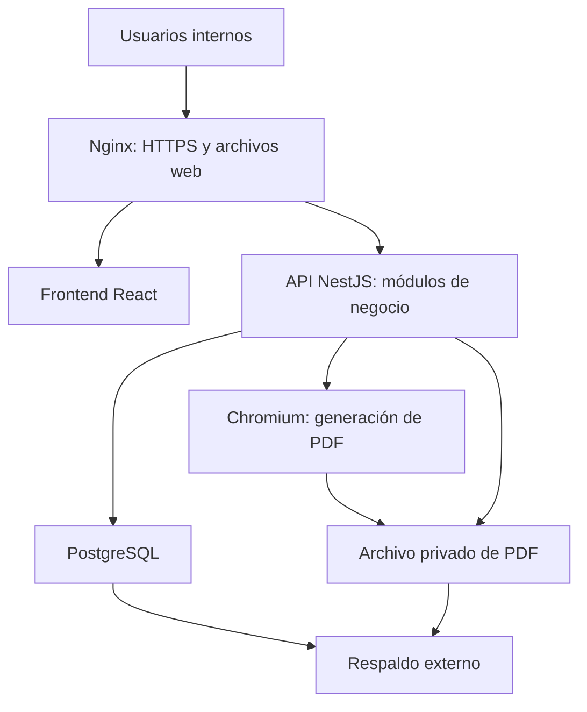
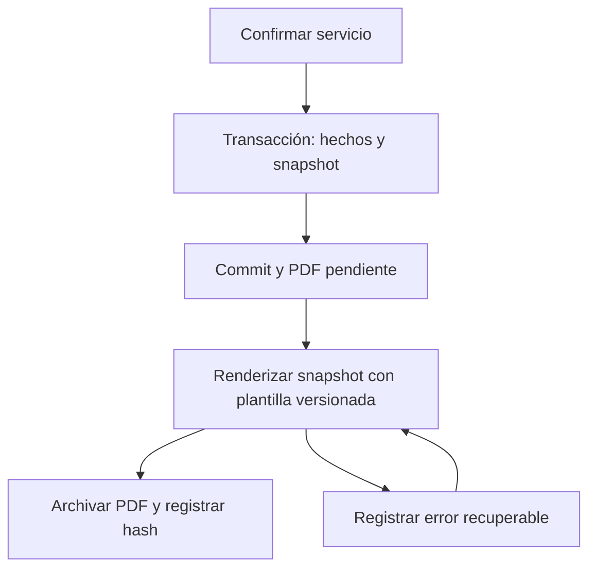

# Arquitectura del proyecto — Segunda entrega

**Proyecto:** Sistema integral de gestión para CILGAS

**Equipo:** Fermín Alliot y Gabriel Antuña — Grupo 213

**Fecha:** 27/09/2026

**Estado:** diseño de etapa 2 aprobado según la devolución registrada en [APROBACION.md](APROBACION.md). No se presenta implementación.

## 1. Decisión arquitectónica

Se mantiene el **monolito modular en un monorepo** establecido en el [ADR 0001](../adr/0001-adoptar-un-monolito-modular-en-monorepo.md). El frontend será una aplicación React con Vite; el backend NestJS expondrá una API REST. PostgreSQL será la única base persistente, accedida principalmente mediante Prisma, según el [ADR 0002](../adr/0002-usar-postgresql-como-fuente-persistente.md).

La solución se organiza por capacidades de negocio, descritas en [MODULOS.md](MODULOS.md). El volumen previsto —aproximadamente 500 obleas, 150 pruebas hidráulicas y 400 movimientos financieros mensuales— y los dos usuarios iniciales no justifican coordinación distribuida. La prioridad es mantener consistencia entre servicios, componentes, documentos y finanzas, permitiendo que dos integrantes trabajen sobre límites comprensibles.

La [referencia funcional](REFERENCIA_FUNCIONAL.md), el [relevamiento del formulario](RELEVAMIENTO_FICHAS.md) y las [reglas de negocio](REGLAS_NEGOCIO.md) documentan las fuentes de este diseño. Los datos se detallan en el [modelo](MODELO_DATOS.md) y en el [diccionario y DDL](../../database/README.md).

El monolito no significa mezclar interfaz y reglas ni ejecutar todo en un contenedor. Frontend, API, generador de PDF y base son componentes de una única solución; no se crean servicios de negocio autónomos ni bases por módulo.

La ruta `/api` de Nginx dirige las peticiones del navegador al backend; los archivos estáticos de React se sirven desde el mismo origen. PostgreSQL y el almacenamiento de documentos permanecen privados. El diagrama representa el despliegue previsto, no servicios ya creados.

## 2. Tecnologías definitivas del diseño

| Área | Elección | Motivo y límite |
| --- | --- | --- |
| Lenguaje | TypeScript | Tipado compartido entre interfaz y servidor. Las reglas se validan también en ejecución. |
| Frontend | React + Vite | Aplicación interna sin SEO; compilación estática y separación de la API. |
| Backend | NestJS sobre Node.js LTS compatible | Organización modular, inyección de dependencias, validación y autorización del lado servidor. |
| Comunicación | REST, JSON y OpenAPI | Contratos explícitos para los recorridos previstos; no se incorpora GraphQL. |
| Persistencia | PostgreSQL | Relaciones, claves, restricciones e integridad transaccional técnica y financiera. |
| Acceso a datos | Prisma | Consultas tipadas y migraciones; SQL explícito y parametrizado cuando sea necesario para restricciones o consultas específicas. |
| Historial documental | JSONB en PostgreSQL + PDF archivado | Snapshot autocontenido, plantilla versionada y archivo inmutable, conforme al ADR 0003. |
| PDF | Playwright con Chromium del lado servidor | Plantilla HTML/CSS de impresión controlada por el equipo para reproducir el formulario. No se delega la generación al navegador del usuario. |
| Autenticación | Local, hash Argon2id y sesiones de servidor | Cuentas individuales; sesión revocable y cookie segura. No se exige un proveedor externo de identidad. |
| Monorepo | pnpm workspaces | Instalación coordinada y contratos compartidos; manifiestos y lockfile se crearán recién al implementar. |
| Contenedores | Docker | Aislamiento y reproducción del entorno de aplicación y base. |
| Proxy y TLS | Nginx | Servirá la aplicación estática y `/api`, terminará HTTPS y limitará exposición de procesos internos. |
| Infraestructura | VPS de Hostinger y dominio existente | Reutilización de la infraestructura del cliente, con recursos y convivencia a confirmar antes del despliegue. |
| Integración continua | GitHub Actions | Controles de formato, lint, tipos, pruebas y compilación; todavía no se incorpora workflow ejecutable. |
| Pruebas backend | Jest, Supertest y PostgreSQL de prueba | Validación de reglas, permisos, API y transacciones reales. |
| Pruebas frontend | Vitest y Testing Library | Comportamiento visible de componentes y formularios. |
| Recorridos y PDF | Playwright | Verificación de recorridos críticos, generación de PDF y revisión de impresión. |

Nginx y Playwright/Chromium resuelven las dos alternativas técnicas abiertas en la primera entrega. Son decisiones de diseño del equipo sujetas a la aprobación de esta entrega; no se atribuyen al cliente ni a la tutora. La elección de React/Vite y NestJS conserva la propuesta de este repositorio, aunque el sistema original utilice una distribución técnica diferente.

No se fijan números de versión patch sin una instalación verificada. Después de la aprobación se seleccionará un conjunto compatible y soportado, se registrarán versiones exactas en el manifiesto, lockfile e imágenes y se fijará la versión de Chromium asociada a Playwright. No se dependerá de etiquetas de imagen cambiantes en producción.

## 3. Organización interna

### 3.1 Backend por módulos y responsabilidades

| Capa | Responsabilidad | Restricción |
| --- | --- | --- |
| Entrada HTTP | Recibir solicitudes, validar su forma, identificar usuario y ejecutar autorización. | No calcula saldos ni coordina persistencia compleja en el controlador. |
| Aplicación | Casos de uso, transacciones y coordinación entre módulos; por ejemplo, confirmar un servicio. | No depende de la interfaz ni replica reglas en varios endpoints. |
| Dominio | Reglas de servicios, componentes, documentos y finanzas; invariantes y vocabulario común. | No obtiene reglas comerciales de componentes React ni de datos arbitrarios del cliente. |
| Infraestructura | Prisma/SQL, sesiones, generación y archivo de PDF, respaldos y proveedores técnicos. | No incorpora decisiones comerciales por efecto accidental de una biblioteca. |

Cada módulo será dueño de sus casos de uso y expondrá operaciones explícitas. El coordinador de confirmación podrá utilizar varias capacidades dentro de una transacción compartida; los módulos no se escribirán mutuamente sus tablas sin pasar por ese contrato. La separación será suficiente para probar reglas sin imponer abstracciones genéricas sin necesidad.

Los DTO de la API y sus validaciones describirán entradas y salidas. Los contratos compartidos no expondrán directamente modelos internos de Prisma, hashes de contraseña, campos administrativos ni objetos completos por comodidad.

**Representación numérica en REST:** las PK/FK de tipo `bigint` se intercambian como cadenas de dígitos; por ejemplo, el identificador `"9007199254740993"` permanece texto en el cliente. Los importes `numeric`/decimal también se envían y reciben como cadenas decimales, por ejemplo `"100000.00"`, con escala y rango validados. La API documentará ambos como cadenas en OpenAPI. No se convierten a `Number` para transporte o cálculos financieros: los identificadores conservan su valor exacto y los importes se calculan con aritmética decimal. Esta convención evita pérdidas de precisión entre PostgreSQL, Prisma, JSON y JavaScript.

### 3.2 Frontend

La aplicación se divide en composición general, funcionalidades y recursos compartidos. Cada funcionalidad contiene sus pantallas, formularios, consultas y presentación de errores. La API determina permisos, reglas y resultados; el frontend refleja esos permisos y mejora la interacción, pero no constituye una barrera de seguridad.

Se prioriza el uso en escritorio y tablet: búsqueda de personas/vehículos, carga ordenada de los grupos de la ficha, hasta cuatro posiciones de cilindro, errores cercanos al campo correspondiente y confirmación explícita de acciones sensibles. El borrador podrá guardarse en el servidor junto con su preparación técnica y documental editable; no se plantea funcionamiento offline ni sincronización automática después de cortes.

### 3.3 Estructura del repositorio

| Ruta | Destino previsto | Contenido permitido en la segunda entrega |
| --- | --- | --- |
| `/README.md` | Presentación del proyecto y acceso a los entregables. | Documentación actualizada. |
| `/CONTEXT.md` | Vocabulario del dominio. | Glosario. |
| `/docs/segunda-entrega/` | Índice, módulos, arquitectura, trazabilidad y registro de revisión. | Markdown y diagramas de diseño. |
| `/docs/adr/` | Decisiones arquitectónicas. | Documentos de decisiones. |
| `/database/` | Modelo, diccionario y DDL de referencia. | Documentación y definición de esquema; sin datos productivos ni ejecución en producción. |
| `/frontend/src/app/` | Composición de la aplicación y navegación. | Sólo marcador vacío `.gitkeep`. |
| `/frontend/src/features/` | Funcionalidades organizadas por módulo. | Sólo marcador vacío `.gitkeep`. |
| `/frontend/src/shared/` | Elementos comunes de interfaz. | Sólo marcador vacío `.gitkeep`. |
| `/backend/src/modules/` | Módulos del negocio. | Sólo marcador vacío `.gitkeep`. |
| `/backend/src/common/` | Infraestructura transversal mínima. | Sólo marcador vacío `.gitkeep`. |
| `/packages/contracts/` | Contratos compartidos cuando se implemente. | Sólo marcador vacío `.gitkeep`. |

Git no versiona directorios completamente vacíos; los `.gitkeep` permiten conservar la estructura solicitada y no contienen código. En esta etapa no se incorporan componentes, controladores, lógica de negocio, manifiestos de aplicación, contenedores ejecutables ni pipelines. El DDL es el artefacto de diseño de base solicitado por la consigna.

## 4. Persistencia y reglas de consistencia

PostgreSQL es la fuente única para datos maestros, historia técnica, hechos financieros, sesiones, snapshots y metadatos documentales. JSONB complementa el modelo relacional únicamente donde se necesita preservar contenido histórico autocontenido; no sustituye claves o relaciones operativas.

El diseño adopta las siguientes reglas:

- Claves primarias estables, claves foráneas explícitas y restricciones de unicidad para identificadores que realmente sean únicos según su ámbito.
- Integridad de configuración: una sola vigente por vehículo y sin un mismo componente individual instalado en dos vehículos a la vez; las restricciones e invariantes se distribuyen entre base y casos de uso de forma documentada.
- Importes con precisión decimal exacta; cantidades y fechas con tipos adecuados. No se utiliza punto flotante para dinero ni números para series o documentos que puedan contener letras/ceros iniciales.
- Fechas de servicio y vencimiento como fechas de calendario; eventos y auditoría como instantes con zona. La aplicación presenta fechas en `America/Argentina/Buenos_Aires` y establece límites diarios explícitos en filtros. Los antecedentes de fabricación/revisión expresados sólo en mes/año conservan esa precisión sin inventar un día.
- Índices para búsquedas habituales, relaciones y filtros de vencimiento/estado; no se indexa cada columna sin justificar una consulta.
- Prohibición de borrados en cascada que destruyan servicios, hechos financieros, fichas o auditoría. Las bajas, rectificaciones y anulaciones conservan trazabilidad.
- Validación en el backend además de las restricciones de base. Una transacción por sí sola no evita condiciones de carrera: se requieren unicidad, control de versión/bloqueo y reintentos acotados cuando corresponda.

El modelo físico y su diccionario en `/database` especifican tablas, campos, tipos, relaciones e índices. Las restricciones que necesiten lógica transaccional se declaran como tales; no se presentan como garantizadas exclusivamente por una clave foránea.

### 4.1 Confirmación de un servicio

La confirmación verifica permisos, estado del borrador, versión leída, configuración del equipo y datos requeridos. Dentro de una transacción se conservan el servicio y sus ítems históricos, los cambios de configuración, los resultados técnicos, el snapshot de la ficha, las obligaciones con proveedores aplicables y la auditoría de la acción. Si alguna escritura falla antes del commit, no queda una confirmación parcial.

Dos solicitudes para el mismo servicio deben producir un único conjunto de efectos. El backend comprobará la transición de estado y aplicará una estrategia de concurrencia con restricciones de base. Una repetición posterior devolverá el resultado existente o un conflicto explícito; nunca generará otra oblea u obligación por haber repetido un clic.

Guardar un borrador permite persistir los datos incompletos de preparación de la ficha y sus intervenciones propuestas, incluidos componentes, números de oblea, fechas y resultados ingresados para revisión. Esta preparación permanece editable y no equivale a emitir una oblea, confirmar un ensayo, instalar un componente, cambiar la configuración vigente ni crear una obligación. La confirmación valida y transforma esos datos en hechos y documentación históricos de forma atómica; la preparación conservada deja de editarse con el servicio confirmado. El anticipo es una acción independiente y explícita de cobro contra ese servicio identificado, tal como se explica en [Módulos](MODULOS.md#51-anticipos-y-borradores). La propuesta de este tratamiento debe validarse junto con el diseño.

### 4.2 Snapshot, PDF y rectificación

El [ADR 0003](../adr/0003-preservar-fichas-confirmadas-como-snapshots.md) requiere conservar tanto el contenido histórico como su representación PDF. El snapshot incluye los datos impresos de personas, vehículo, taller/sujetos regulatorios, operación, obleas, regulador, cilindros, válvulas y responsables aplicables. El identificador de plantilla y la versión de ficha forman parte de su contexto.

El archivo PDF no participa en la transacción ACID de PostgreSQL. Por eso el flujo distingue persistencia del documento y generación de su representación:

El backend renderiza el snapshot confirmado con Playwright/Chromium, usando una plantilla propia con estilos de impresión. El documento mantiene metadatos del estado de generación —pendiente, generado o error— y del archivo: ubicación privada, hash de integridad y versión de plantilla. El archivo se escribe con un nombre estable y de forma atómica; el reintento es idempotente. Si el proceso se interrumpe entre crear el archivo y actualizar metadatos, la recuperación verifica y reutiliza el archivo coherente antes de marcarlo como generado.

La primera descarga puede esperar la generación o informar que está pendiente; un error ofrece un reintento autorizado sin volver a confirmar el servicio. Se prevé detectar pendientes y errores al recuperar el proceso y desde una acción administrativa. No se incorpora un broker ni procesamiento distribuido para resolver este volumen.

La plantilla se alimenta sólo con datos validados, escapa contenido aportado por usuarios y utiliza recursos locales; el render no navega hacia URLs arbitrarias. El acceso al PDF se realiza mediante una ruta autorizada de la API, sin enlaces públicos predecibles. Los archivos confirmados no se regeneran en silencio con una plantilla nueva.

Una rectificación crea una nueva versión, motivo, autor y vínculo con la ficha anterior. No reescribe el snapshot, no cambia el PDF anterior y no modifica por sí sola cobros u obligaciones. Una corrección que afecte hechos económicos o técnicos requiere el caso de uso correspondiente y validación de la regla aplicable.

### 4.3 Hechos financieros y saldos

Se conserva el [ADR 0004](../adr/0004-derivar-perspectivas-financieras-desde-hechos.md): existe una sola fuente de hechos y no dos libros de caja editables.

Para una fecha de corte, considerando el estado y los reversos aplicables hasta esa fecha:

**Saldo real = cobros efectivos − egresos efectivos.**

**Saldo teórico = saldo real − obligaciones con proveedores pendientes.**

Los egresos efectivos incluyen pagos de obligaciones, gastos generales y devoluciones, cada uno una sola vez. La deuda pendiente se obtiene de obligaciones menos pagos aplicados y ajustes válidos. Pagar una obligación disminuye simultáneamente dinero y deuda; no vuelve a descontar su importe completo del saldo teórico. Una venta o liquidación presentada no es un cobro.

Ejemplo: un cobro de ARS 30.000, una obligación de ARS 20.000 y un pago de ARS 8.000 producen saldo real ARS 22.000, deuda ARS 12.000 y saldo teórico ARS 10.000. Las consultas permitirán ir desde el total hasta esos hechos.

Los cobros combinados y los pagos distribuidos conservan detalles cuya suma coincide con el encabezado. Para una salida combinada, `operaciones_egreso` representa la operación y `egresos` sus fracciones por medio de pago; se suman las fracciones una sola vez, sin agregar también el importe de control de la cabecera. Las aplicaciones a obligaciones distribuyen esas fracciones sin originar otro egreso. Guardar o anular la operación conserva la consistencia del conjunto de forma atómica. La aplicación bloqueará sobreaplicaciones no permitidas mediante transacciones y control concurrente. No se mantienen saldos a favor generales ni se realizan devoluciones sin registrar un hecho explícito y auditable.

La fecha de corte inicial no incorpora saldos bancarios o deudas históricas. Estos indicadores describen el flujo registrado desde la puesta en marcha, no un arqueo ni una conciliación bancaria. Un filtro por período mostrará por separado flujo del período y saldo acumulado a su fecha final; el segundo considera todos los hechos desde la fecha de corte.

## 5. Seguridad y privacidad

La autenticación local empleará Argon2id con parámetros calibrados para el entorno y sesiones revocables del servidor. El navegador recibirá una cookie `HttpOnly`, `Secure` y `SameSite`; la aplicación incorporará protección CSRF para operaciones mutadoras. Se limitarán intentos de inicio de sesión y se evitarán mensajes que expongan detalles innecesarios de cuentas.

Toda operación comprobará autorización en el backend. Las consultas aplicarán el alcance del usuario también a filtros, exportaciones futuras, PDF, alertas y detalle de registros. Los costos, pagos a proveedores y saldos globales no se incluirán en respuestas del operador para luego ocultarlos visualmente.

El alcance técnico compartido, confirmado por el equipo el 02/10/2026, permite al operador continuar borradores de otros usuarios y consultar fichas e historia técnica del taller. Ese acceso no depende de haber creado el registro; cada acción conserva su autor y sigue sujeta a las capacidades del rol. Los movimientos financieros del operador mantienen el alcance propio definido en [la matriz de permisos](MODULOS.md), y compartir un borrador no expone los costos ni los movimientos ajenos asociados.

La API validará tipos, límites, formatos y relaciones entre datos. Las consultas SQL explícitas usarán parámetros. El registro de errores y auditoría omitirá contraseñas, tokens y cookies; la auditoría conservará sólo los datos necesarios para explicar la acción y estará restringida a administradores.

El despliegue expondrá únicamente HTTPS y el acceso administrativo del servidor según su configuración. PostgreSQL, el proceso Node y los archivos PDF no se publicarán directamente. Las credenciales se inyectarán por configuración fuera de Git y se usarán permisos mínimos en aplicación, base y respaldos. El repositorio público contendrá ejemplos sintéticos; las fichas reales y los datos de clientes no se publicarán.

## 6. Despliegue y continuidad

Después de la aprobación se prepararán los contenedores, configuración de Nginx y automatización de despliegue. La aplicación y PostgreSQL tendrán almacenamiento persistente; recrear un contenedor no equivaldrá a reiniciar la información. Las migraciones se revisarán y respaldarán antes de aplicarse. Una falla de despliegue se resolverá restaurando una versión compatible de aplicación y datos conforme al cambio realizado, sin asumir que revertir código revierte una migración destructiva.

Se separarán desarrollo, pruebas y producción. Las pruebas usarán bases aisladas y datos sintéticos. Se verificarán recursos suficientes para ejecutar Chromium, almacenamiento de archivos y retención de respaldos antes de habilitar el servicio.

| Compromiso | Diseño previsto | Evidencia requerida antes de la entrega final |
| --- | --- | --- |
| Respaldo diario | Copia consistente de PostgreSQL, PDF archivados y configuración necesaria para recuperar el sistema; secretos por un canal protegido. | Registro de ejecución y verificación de que el conjunto tiene datos y archivos coherentes. |
| Almacenamiento externo | Copia fuera del VPS, acceso restringido y protección en tránsito y almacenamiento. | Ubicación operativa configurada y prueba de recuperación desde ese destino. |
| Retención | Al menos 30 días de copias, con control de espacio y eliminación según política. | Listado de copias disponibles y política documentada. |
| RPO | Objetivo inicial: pérdida máxima de 24 horas de información. | Frecuencia real y alerta visible ante un respaldo fallido. |
| RTO | Objetivo inicial: recuperar el servicio en cuatro horas. | Restauración cronometrada en entorno aislado, con resultados y desvíos. |
| Verificación funcional | Acceso, servicio, deuda, ficha y archivo PDF recuperados. | Acta de restauración con comprobaciones de una muestra consistente. |

RPO y RTO son objetivos de diseño hasta medirlos. La base y los archivos deben respaldarse como un conjunto coherente, con manifiesto de documentos; los PDF inmutables pueden copiarse antes y verificarse contra los metadatos del respaldo. No basta con tener un archivo de respaldo que nunca se haya restaurado.

Ante una caída extraordinaria de Internet, CILGAS continúa en papel y registra la operación al recuperar conexión. No se promete operación offline ni sincronización automática. Los errores del servidor, del generador de PDF y de los respaldos deben quedar visibles mediante registros y estado verificable por el administrador.

## 7. Estrategia de validación futura

| Riesgo | Comprobación mínima prevista |
| --- | --- |
| Pérdida de precisión en la API | Enviar y recuperar un ID superior al entero seguro de JavaScript e importes con centavos; verificar que siguen siendo cadenas y conservan exactamente su valor. |
| Borrador técnico perdido o publicado antes de tiempo | Guardar y recuperar preparación de ficha e intervenciones; verificar que siguen editables y no existen resultados confirmados, cambio de configuración ni obligaciones por ese guardado. |
| Confirmación parcial o duplicada | Integración sobre PostgreSQL con fallo intermedio y dos intentos concurrentes; verificar efectos únicos o rollback completo. |
| Historia técnica incoherente | Intentar dos configuraciones vigentes y un componente instalado simultáneamente; verificar rechazo y consulta histórica. |
| Modificación de ficha histórica | Cambiar datos maestros y comparar snapshot/PDF archivado; rectificar y verificar coexistencia de ambas versiones. |
| Formulario ilegible o incompleto | Casos sintéticos de revisión anual y quinquenal con uno y cuatro cilindros, series largas y campos opcionales; renderizar y revisar todas las páginas y una impresión. |
| Fallo al producir PDF | Interrumpir render/archivo y reintentar; confirmar que el servicio no se repite y los metadatos terminan coherentes. |
| Error financiero | Probar parcial, combinado, anticipo, anulación, obligación, pago parcial y pago final; contrastar saldo real/teórico con hechos conocidos. |
| Duplicación de cupón o cobro | Intentos simultáneos de liquidar el mismo cupón y repetición del registro de cobro; verificar aplicación única y sumas. |
| Acceso indebido | Peticiones directas con operador a endpoints y registros restringidos, incluyendo PDF y alertas; verificar rechazo y ausencia de campos sensibles. |
| Vencimientos omitidos | Fechas en límites de día, vencidos, próximos y sin fecha; verificar selección y zona de operación. |
| Respaldo inutilizable | Restaurar en base/directorio aislados y comprobar relaciones, importes y PDF, midiendo la recuperación. |

Durante el desarrollo se ejecutarán pruebas focalizadas según el cambio, luego comprobaciones relacionadas y de tipos cuando corresponda. La integración verificará formato, lint, tipos, pruebas y build; los E2E se concentrarán en recorridos críticos. No se repiten suites completas sin un riesgo concreto. React Doctor puede complementar la revisión de la interfaz, sin reemplazar criterios funcionales o de seguridad.

En la segunda entrega, la validación posible es revisar la coherencia del diseño, la cobertura de los campos del formulario, el DDL en una base descartable y la documentación. No se afirma haber probado una aplicación aún inexistente.

## 8. Límites y decisiones pendientes de validación

La arquitectura conserva los límites de la primera entrega: no integra SICGNC ni ARCA, no incorpora contabilidad formal, compras/stock completos, portales de clientes, microservicios ni migración masiva de historia.

Antes de codificar las reglas afectadas deben revisarse con la tutora y los responsables correspondientes:

1. Identidad y responsabilidades de CILGAS frente a TdM, PEC y CRPC, sin deducirlas sólo de una ficha.
2. Significado y formato del identificador externo de SICGNC y reglas aceptadas de rectificación.
3. Reglas excepcionales de retiro/disponibilidad de cilindros usados, manteniendo fuera el inventario integral.
4. Correspondencia final entre los campos de la ficha real, el modelo y la plantilla propuesta, incluidos resultados no satisfactorios y fechas regulatorias.

El tratamiento de anticipos quedó ratificado por el equipo el 02/10/2026: devolución como egreso vinculado y cancelación del borrador conservando la historia, con la simplicidad operativa descrita en [las reglas de negocio](REGLAS_NEGOCIO.md).

La selección de Nginx y Playwright/Chromium forma parte del diseño de etapa 2 aprobado. La [validación del diseño](VALIDACION.md) diferencia las comprobaciones realizadas de las pruebas futuras. El [registro de revisión](APROBACION.md) conserva la devolución de la tutora y el alcance de su evidencia.
